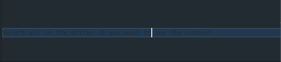

Stealth Typer is a VSCode Extension that makes your text invisible by setting the text color to background color, so that you Make text invisible so that You can type comfortably in public places without worrying about someone peeking at your screen.

Select all in the editor if you want to see the content for yourself.

When turning Stealth Typing on, it's recommended to also turn Highlight Current Line on and Spell Check off to get best experience.
